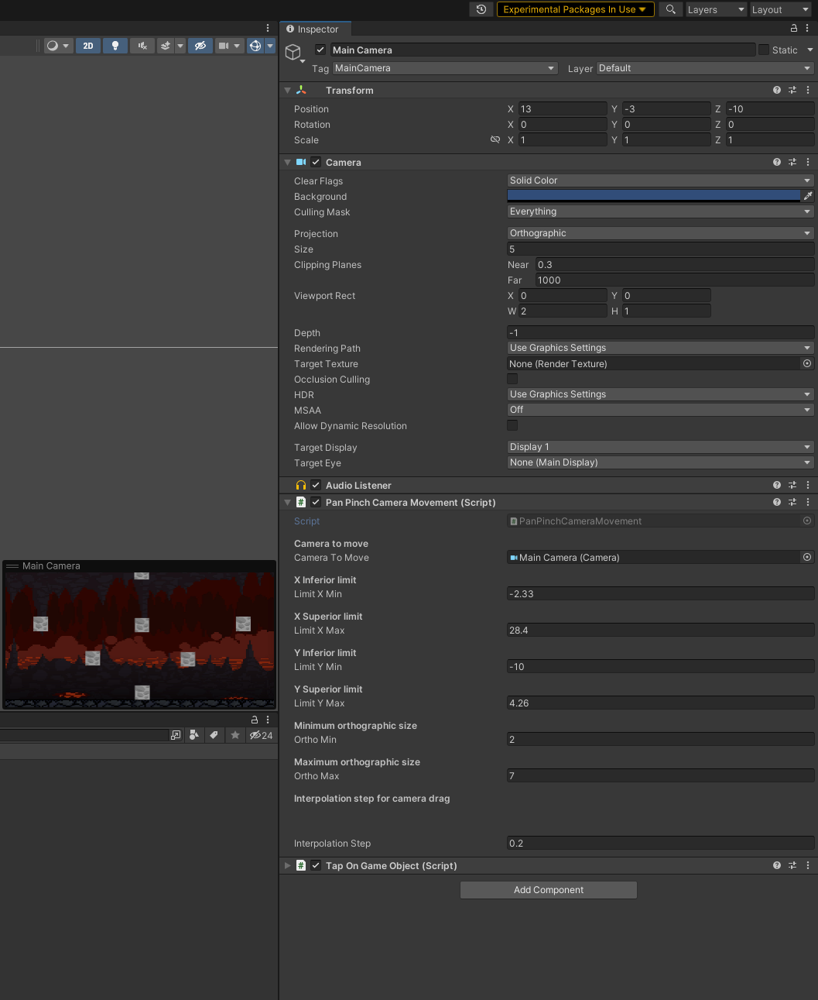

<!-- PROJECT LOGO -->


<br />
<p align="center">
  <h3 align="center"> Camera Movement By Touch </h3>

  <p align="center">
    README for Camera Movement
    <br />
    <a href="https://github.com/sergane13/Camera-Movement-By-Touch"><strong>Explore the docs »</strong></a>
    <p align="center">
    
    
    
    </p>
    <br />
    <br />
    <a href="https://github.com/sergane13/Camera-Movement-By-Touch/issues">Report Bug</a>
    ·
    <a href="https://github.com/sergane13/Camera-Movement-By-Touch/issues">Request Feature</a>
  </p>
</p>


<!-- TABLE OF CONTENTS -->
<details open="open">
  <summary>Table of Contents</summary>
  <ol>
    <li>
      <a href="#about-the-project">About The Project</a>
      <ul>
        <li><a href="#built-with">Built With</a></li>
      </ul>
    </li>
    <li>
      <a href="#getting-started">Getting Started</a>
      <ul>
        <li><a href="#installation">Installation</a></li>
        <li><a href="#How-to-use-it">How to use it</a></li>
      </ul>
    </li>
    <li><a href="#usage">Usage</a></li>
    <li><a href="#license">License</a></li>
  </ol>
</details>


<!-- ABOUT THE PROJECT -->
## About The Project


<p>
  Out of the box sollution for managing movement of camera in your game. 
</p>


### Built With

* [Unity](https://unity.com/)
<!-- GETTING STARTED -->
## Getting Started

### Installation

1. Clone the repo
   ```sh
   git clone https://github.com/sergane13/Camera-Movement-By-Touch
   ```
2. Open project in Unity

3. Add scripts to any gameObject you want and assign the main camera
    <p>
      
    </p>
 

### How to use it

```bash
  PanPinchCameraMovement.cs
  
    @param
      cameraToMove
      limitXmin
      limitXmax
      limitYmin
      limitYmax
      orthoMin
      orthoMax
      interpolationStep

  TapOnGameObject.cs

    @param
      sensitivity
```
<!-- USAGE EXAMPLES -->
## Usage

* You can test the usage of the scripts in our game [Khyron Realm](https://khyron-realm.com/)
* You can also see the [Youtube](https://www.youtube.com/watch?v=uhusqjg41g8&t=78s&ab_channel=KhyronRealm) video


<!-- CONTRIBUTING -->
## Project structure

```bash
< PROJECT ROOT >
   |
   |--Editor
   |--Resources
      |-- first.png
      |-- second.png
   |--Scenes
      |--Test-Scenes.unity
   |--Scripts 
      |--PanPinchCameraMovement.cs     # Script for managing movement of camera
      |--TapOnGameObject.cs            # Script for managing touch of a gameObject
   |                          
  ************************************************************************
```


<!-- LICENSE -->
## License

Project Template adapted from [Othneil Drew](https://github.com/othneildrew) / [Best-README-Template](https://github.com/othneildrew/Best-README-Template).


<!-- MARKDOWN LINKS & IMAGES -->
<!-- https://www.markdownguide.org/basic-syntax/#reference-style-links -->
[product-screenshot]: images/screenshot.png
