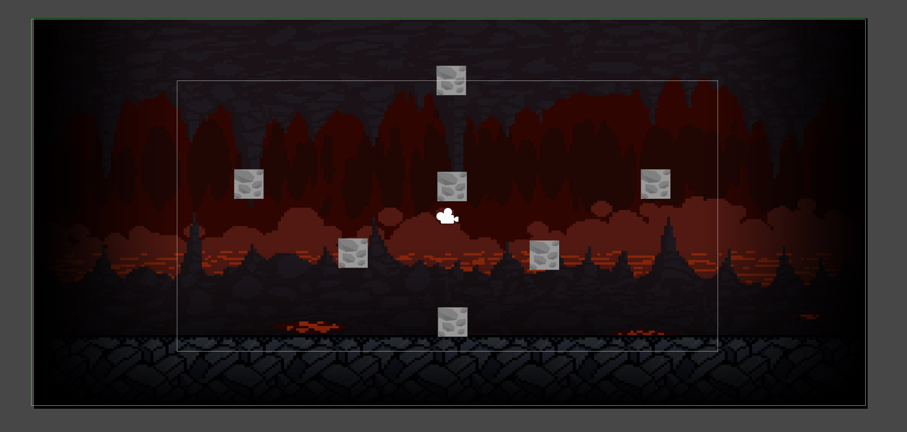

<!-- PROJECT LOGO -->
<br />
<p align="center">
  <h3 align="center"> Camera Movement By Touch </h3>

  <p align="center">
    README for Camera Movement
    <br />
    <a href="https://github.com/sergane13/Camera-Movement-By-Touch"><strong>Explore the docs »</strong></a>
    <br />
    <br />
    <a href="https://github.com/sergane13/Camera-Movement-By-Touch/issues">Report Bug</a>
    ·
    <a href="https://github.com/sergane13/Camera-Movement-By-Touch/issues">Request Feature</a>
  </p>
</p>


<!-- TABLE OF CONTENTS -->
<details open="open">
  <summary>Table of Contents</summary>
  <ol>
    <li>
      <a href="#about-the-project">About The Project</a>
      <ul>
        <li><a href="#built-with">Built With</a></li>
      </ul>
    </li>
    <li>
      <a href="#getting-started">Getting Started</a>
      <ul>
        <li><a href="#prerequisites">Prerequisites</a></li>
        <li><a href="#installation">Installation</a></li>
      </ul>
    </li>
    <li><a href="#usage">Usage</a></li>
    <li><a href="#roadmap">Roadmap</a></li>
    <li><a href="#contributing">Contributing</a></li>
    <li><a href="#license">License</a></li>
    <li><a href="#contact">Contact</a></li>
    <li><a href="#acknowledgements">Acknowledgements</a></li>
  </ol>
</details>


<!-- ABOUT THE PROJECT -->
## About The Project



Out of the box sollution for managing movement of camera in your game. 

### Built With

* [Unity](https://unity.com/)
<!-- GETTING STARTED -->
## Getting Started

### Installation

1. Clone the repo
   ```sh
   git clone https://github.com/sergane13/Camera-Movement-By-Touch
   ```
2. Open project in Unity


<!-- USAGE EXAMPLES -->
## Usage

More detailes can be found on [Google Drive](https://docs.google.com/document/d/1CHdDfEm5BDM8vAbeubNgLF-Et8YwMgCbreD4CC6dSfo/edit)


<!-- ROADMAP -->
## Roadmap

See the [open issues](https://github.com/target-software/Unlimited-Game-MiningGame/issues) for a list of proposed features (and known issues).


<!-- CONTRIBUTING -->
## Project structure

```bash
< PROJECT ROOT >
   |
   |--Editor
   |--Resources
   |--Scenes
   |--Scripts     
   |                          
  ************************************************************************
```


<!-- LICENSE -->
## License

Project Template adapted from [Othneil Drew](https://github.com/othneildrew) / [Best-README-Template](https://github.com/othneildrew/Best-README-Template).


<!-- MARKDOWN LINKS & IMAGES -->
<!-- https://www.markdownguide.org/basic-syntax/#reference-style-links -->
[product-screenshot]: images/screenshot.png
